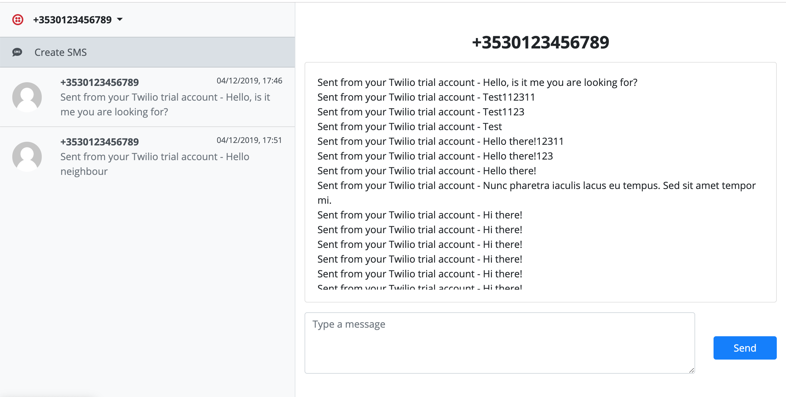

<<<<<<< HEAD
<<<<<<< HEAD
<a href='https://github.com/jkrclaro/warkphone'></a>

# Warkphone
[](https://circleci.com/gh/jkrclaro/warkphone/tree/master)

# General Information
- Website: https://www.warkphone.com
=======
<a href='https://github.com/jkrclaro/sidefone'></a>
=======
<a href='https://github.com/jkrclaro/sidefone'></a>
>>>>>>> Point to src/server

# Sidefone
[](https://circleci.com/gh/jkrclaro/sidefone)

<<<<<<< HEAD
<<<<<<< HEAD
# General Information
- Website: https://www.sidefone.com
>>>>>>> Add speech-bubble CSS
- Source code: https://github.com/jkrclaro/startup
- Issue tracker: https://trello.com/b/7Pm8Ltmg/startup
=======
Chess game engine that leads all moves to a checkmate.
>>>>>>> Update README
=======
Modern business phone on your browser.
>>>>>>> Update README

## Overview



|     | Features
:---: | :---
:speech_balloon: | **Message someone**. Send a text to someone using your Sidefone.

## Requirements

You'll need the following:

- [Python](https://www.python.org/) >= 3.8+
- [Docker](https://www.docker.com/)
- Modern browser like Google Chrome


## Getting started

Install dependencies using [Pipenv](https://github.com/pypa/pipenv):

```sh-session
pipenv install
```

Run the app locally using docker-compose

```sh-session
docker-compose up
```

Lastly, you will see the URL can be visited in

```
localhost:5000
```

<<<<<<< HEAD
<<<<<<< HEAD
For more documentations, [see docs.](https://github.com/jkrclaro/warkphone/tree/master/docs)
=======
For more documentations, [see docs.](https://github.com/jkrclaro/sidefone/tree/master/docs)
>>>>>>> Add speech-bubble CSS
=======
Use this URL in your browser to start the app.
>>>>>>> Update README
